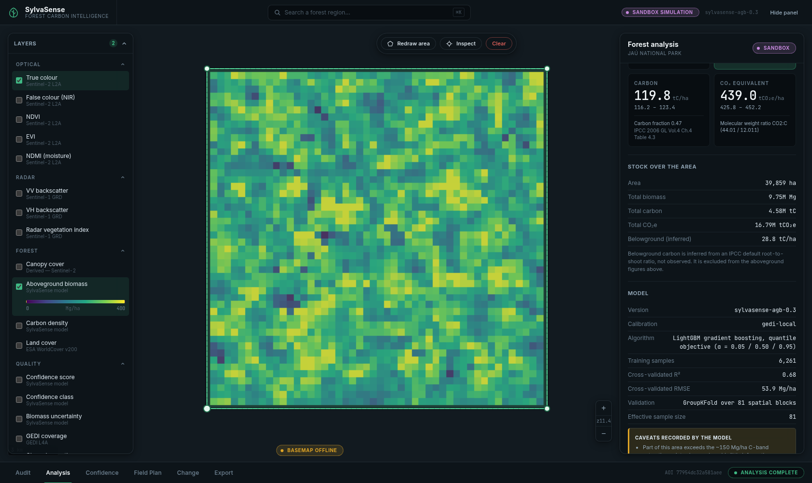
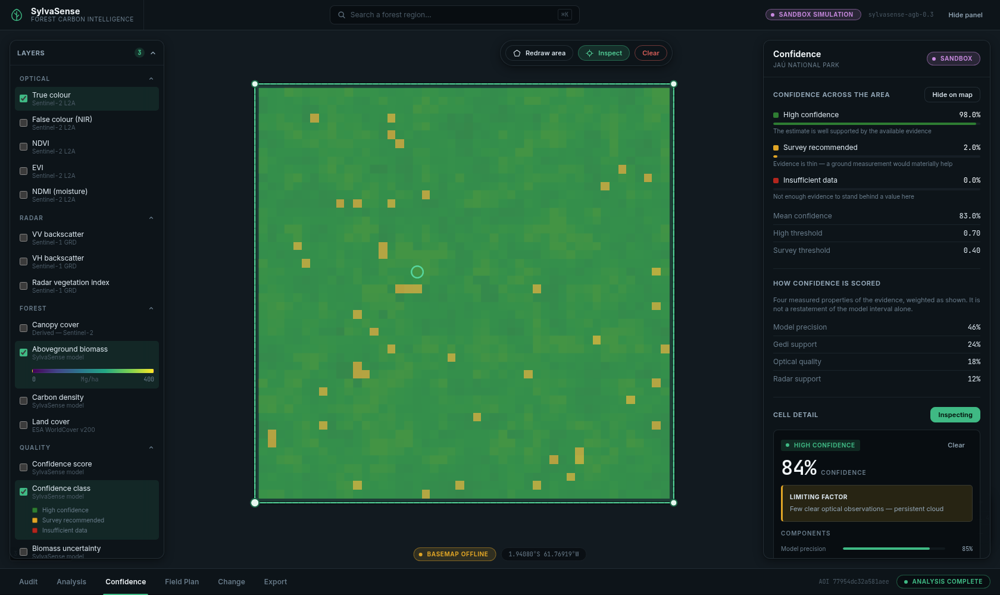
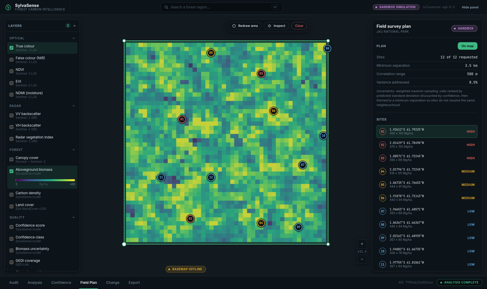
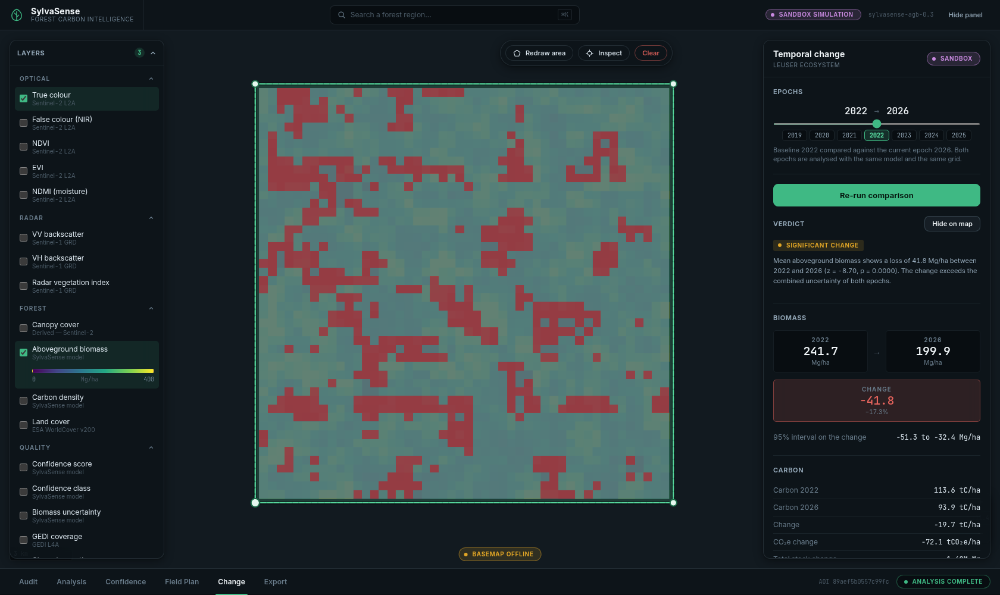

# SylvaSense

**Forest carbon intelligence from Earth observation.** Draw a forest, and get
canopy cover, aboveground biomass, carbon, CO₂e, per-cell uncertainty, a
confidence map, a field survey plan and year-over-year change — with every
number traceable to the sensor, model and date that produced it.



---

## The one thing to know first

SylvaSense reads real satellite data through **Google Earth Engine**. If no
Earth Engine credential is configured, it does **not** invent observations.
It says so — in the header, in every panel, in the API, and on the first page
of every exported file — and runs a clearly-labelled **forward model** instead
so the pipeline stays exercisable.

| Mode | Indicator | What the numbers are |
|---|---|---|
| `LIVE_EARTH_ENGINE` | ● LIVE EARTH ENGINE | Sentinel-2, Sentinel-1, GEDI, Copernicus DEM, ESA WorldCover |
| `SANDBOX_SIMULATION` | ● SANDBOX SIMULATION | A physically-based simulation. Not an observation. Not for carbon accounting. |

To switch to real data, see **[docs/EARTH_ENGINE_SETUP.md](docs/EARTH_ENGINE_SETUP.md)** —
four commands and a one-time service-account registration.

---

## Quick start

```bash
# Backend
cd backend
python3 -m venv .venv && .venv/bin/pip install -r requirements.txt
.venv/bin/python run.py                      # http://127.0.0.1:8000

# Frontend (second terminal)
cd frontend
npm install
npm run dev                                  # http://127.0.0.1:5173
```

Open <http://127.0.0.1:5173>, pick a demo area, press **Run audit**, then
**Run analysis**.

The frontend proxies `/api` to the backend, so the browser never holds a
credential and Earth Engine tiles are served through the backend.

---

## What it does

### 1. Audit before analysis
Nothing expensive runs until SylvaSense has checked what actually observed this
area: Sentinel-2 scenes under the cloud limit, Sentinel-1 dual-pol
acquisitions, GEDI footprints, DEM and land-cover coverage. The verdict is
`READY`, `PARTIAL_DATA` or `INSUFFICIENT_DATA`, and an area that cannot produce
a defensible result is refused rather than attempted.

### 2. Biomass, with a real interval
Two calibration paths, and the active one is always reported:

- **`gedi-local`** — LightGBM quantile regression (α = 0.05 / 0.50 / 0.95)
  trained on the GEDI L4A footprints that fall **inside this AOI**, with
  Sentinel-2 and Sentinel-1 predictors sampled at each footprint. The 90%
  interval comes from the quantile models themselves, not from a symmetric
  error bar. Skill is reported from **spatially blocked** cross-validation —
  random k-fold over autocorrelated footprints reports optimistic scores.
- **`regional-default`** — a published log-linear C-band relationship, used
  only when too few footprints exist to calibrate locally. It is marked
  **uncalibrated** everywhere it appears, with deliberately wide bounds.

With neither, the pipeline raises `INSUFFICIENT_DATA` rather than guessing.

### 3. Carbon that inherits its uncertainty
Carbon is biomass × 0.47 (IPCC 2006 GL Vol.4 Ch.4 Table 4.3); CO₂e is carbon ×
44.01/12.011. Both are fixed constants, so the carbon interval is the biomass
interval — nothing is narrowed along the way. Belowground carbon is reported
**separately** from an IPCC root-to-shoot default, never folded in silently.

### 4. Confidence that explains itself
Confidence is not a restatement of the model interval. It combines four
measured properties of the evidence, and the reason a cell scores badly is
whichever component **actually** dominated the loss:

| Component | Weight | What it measures |
|---|---|---|
| Model precision | 46% | Relative width of the 90% prediction interval |
| GEDI support | 24% | Calibration footprints near the cell |
| Optical quality | 18% | Share of clear Sentinel-2 observations |
| Radar support | 12% | Dual-pol availability, discounted for slope-induced layover |



### 5. A field plan that earns its visits
Sites are ranked by predicted standard deviation discounted by confidence, then
thinned to a minimum separation so two sites never resolve the same correlation
neighbourhood. Each site reports a **computed** expected variance reduction —
the share of the area's total biomass variance inside its neighbourhood — plus
a terrain-derived access note.



### 6. Change that survives a significance test
A difference is only called a change when it clears both a two-sided z-test on
the difference of area means and a 5 Mg/ha materiality floor — and when neither
epoch relied on the uncalibrated fallback, because a change measured against an
uncalibrated estimate is not interpretable.

The area mean uses an **effective sample size** derived from spatial blocks,
because neighbouring cells do not carry independent errors.



### 7. Exports that cannot be misread
GeoJSON (AOI, per-cell polygons, survey sites), CSV with a provenance header,
and a PDF audit dossier restating every input, model choice, caveat and
citation. A simulated run is stamped as such on the dossier's first page and in
the first line of every file.

---

## Honest behaviour, by design

These are not edge cases that were papered over — they are the product working:

- **Beyond 51.6° latitude** GEDI does not observe. A boreal AOI correctly falls
  back to the uncalibrated regional model and reports **100% insufficient
  data** rather than a confident number. Two demo areas (Tongass, Białowieża)
  are deliberately in this band as worked examples.
- **Scattered loss without an area-level verdict** is reported as exactly that:
  significant per-cell loss can be real while the whole-area mean stays within
  noise, and the interface says both.
- **No fabricated progress.** Job progress is completed steps out of total
  steps. Within a step, where the backend cannot report a fraction, the UI
  shows an indeterminate indicator rather than a number.
- **No fake buttons.** Every control calls a real endpoint.
- **Errors are readable.** Every failure carries a plain-language title, likely
  causes and a concrete next step. A raw 500 cannot reach the UI.

---

## Architecture

```
backend/
  app/core/          settings, and the user-facing error contract
  app/providers/     base.py defines the contract; earthengine.py is the real
                     path; sandbox.py is a forward model, never an observation;
                     registry.py selects and always reports which is active
  app/science/       geo, indices, biomass, carbon, confidence, fieldplan,
                     change — all provider-agnostic
  app/analysis/      pipeline, result store, gazetteer
  app/render/        colour ramps and on-the-fly XYZ tile rendering
  app/export/        GeoJSON, CSV, PDF dossier
  app/api/           layer catalogue, schemas, routes
frontend/
  src/lib/           typed API client, basemap, polygon draw engine
  src/components/    map, panels, design-system primitives
  e2e/               Playwright tests against the real stack
```

The provider boundary is what makes the sandbox honest: it substitutes only the
**pixel source**. The biomass model, uncertainty propagation, confidence
scoring, field planner and change detection are the same code either way, so
supplying a credential swaps the data without touching the science.

### Map layers

Optical (true colour, false colour, NDVI, EVI, NDMI) · Radar (VV, VH, RVI) ·
Forest (canopy, biomass, carbon, land cover) · Quality (confidence score and
class, biomass uncertainty, GEDI coverage, clear observations) · Terrain
(elevation, slope) · Change (biomass, carbon, significance class).

Tiles are rendered on demand from arrays already in memory, so toggling a layer
costs no recomputation. Legends are generated from the same ramp definitions
the tiles are painted with, so a legend cannot drift from the pixels.

### Basemap

Pick one in the **Basemap** group at the top of the layer panel. All options are
keyless:

| Option | Source | Good for |
|---|---|---|
| **Satellite** (default) | Esri World Imagery | Seeing the actual canopy under an analysis layer |
| **Dark canvas** | Esri Dark Gray | A quiet backdrop so analysis colours dominate |
| **Terrain** | Esri World Terrain | Relief and landform context |
| **Streets** | OpenStreetMap | Place names and access routes for a field crew |
| **None** | Bundled Natural Earth | Works with no network at all |

The choice is remembered across reloads, because which provider works is a
property of your network rather than of the task.

Underneath every option sit bundled Natural Earth vectors and a graticule, so a
tile host that is blocked or down costs detail rather than the whole map. Set
`VITE_BASEMAP_URL` to add your own provider to the list.

> The default was CARTO until it moved its public basemaps behind an API key
> and began serving `API KEY REQUIRED` watermarks instead of failing — a
> degradation no error handling can detect, since the tiles load successfully.
> Hence a switcher rather than a single hard-coded provider.

---

## Testing

```bash
cd backend  && .venv/bin/python -m pytest      # 85 tests
cd frontend && npx playwright test             # 16 tests, real stack
```

Backend tests cover geodesy (a degree square must shrink with latitude),
interval ordering, the GEDI fallback, IPCC constants, confidence bounds, field
plan separation, change significance, the tile service and every export.

End-to-end tests drive a real browser against a real backend and assert on
substance: that carbon equals 47% of biomass on screen, that toggling a layer
changes the live MapLibre style, that markers land inside the map and spread
apart, that a downloaded dossier begins with `%PDF-`, and that the console
stays clean.

---

## Configuration

Copy `.env.example` to `backend/.env` (git-ignored).

| Variable | Default | Purpose |
|---|---|---|
| `SYLVASENSE_PROVIDER` | `auto` | `auto` \| `earthengine` \| `sandbox` |
| `SYLVASENSE_EE_SERVICE_ACCOUNT_FILE` | — | Service-account JSON key |
| `SYLVASENSE_EE_PROJECT` | — | Cloud project with the Earth Engine API enabled |
| `SYLVASENSE_MAX_AOI_KM2` | `2500` | Largest area accepted in one run |
| `SYLVASENSE_MIN_GEDI_SAMPLES` | `40` | Below this, no local calibration is attempted |
| `SYLVASENSE_ANALYSIS_SCALE_M` | `30` | Native working resolution |
| `VITE_BASEMAP_URL` | — | Adds a custom tile source to the basemap list |

`SYLVASENSE_PROVIDER=earthengine` makes a missing credential a hard failure
instead of a fallback — the right setting for any deployment where a simulated
result must never be produced.

---

## References

Rouse et al. (1974) NDVI · Huete (1988) SAVI · Huete et al. (2002) EVI ·
Gao (1996) NDMI · Carlson & Ripley (1997) and Gutman & Ignatov (1998)
fractional cover · Kim & van Zyl (2009) dual-pol RVI ·
Attema & Ulaby (1978) Water Cloud Model · Adams et al. (1986) spectral mixture
analysis · IPCC 2006 Guidelines Vol. 4 Ch. 4 carbon fraction and root-to-shoot.
